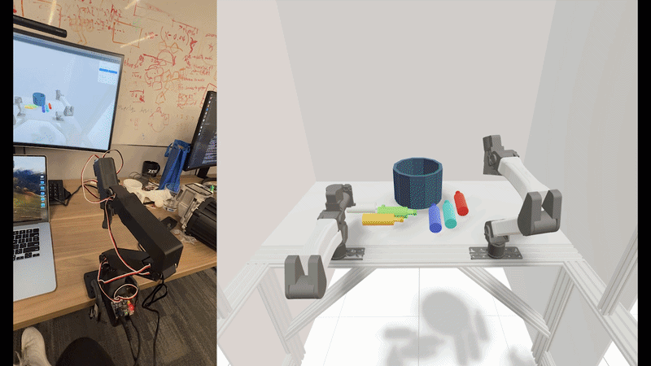

# robots_realtime

A research codebase for real-time robot teleoperation, policy deployment, and data collection.

## Why this exists

Most robot learning codebases treat the data collection stack as an afterthought — a pile of scripts that record to ROS bags and break when you swap hardware. `robots_realtime` was built around a different premise: **the collection stack should be as modular and swappable as the policy itself.**

The core insight is that robot learning pipelines have two separable concerns:

- **Agents** — anything that produces joint commands: a GELLO leader arm, a viser IK gizmo, a diffusion policy, a scripted trajectory
- **Environments** — anything that consumes commands and produces observations: physical robot arms, cameras, MuJoCo simulation

These are composed at runtime from a YAML config. Swapping a GELLO for a trained policy, or swapping real hardware for a sim, is a one-line config change. The recording format (MCAP + MP4), timestamps, and file layout are identical regardless of which agent or environment is in use — so offline training pipelines don't need to change when you change the data source.

Concretely, this makes it straightforward to:

- Collect demonstrations with a physical leader arm, then replay them through sim for augmentation
- Run a trained policy on hardware using the exact same config structure as the teleop session that generated its training data
- Switch between bimanual YAM arms, Franka Panda, or a MuJoCo sim without changing your training pipeline
- Add a new agent (new hardware, new model architecture) without touching anything in the environment or recording layer




For details on building your own YAM active leader arms see the [lerobot_teleoperator_yamactiveleader repo](https://github.com/uynitsuj/lerobot_teleoperator_yamactiveleader).

---

## Architecture

### The agent / environment split

Every session is a graph of **nodes**, each running in its own subprocess with its own MCAP writer. Nodes come in two kinds:

**Agent nodes** — produce commands (`joint_pos`) from observations:
- `AgentNode` wrapping `GelloLeaderAgent` — GELLO leader arm (one node per arm, one MCAP per arm)
- `AgentNode` wrapping `FrankaPyrokiViserAgent` — browser IK gizmo for Franka
- `AgentNode` wrapping `DiffusionPolicyAgent` / `AsyncPi0Agent` — learned policies
- `AgentNode` wrapping `DummyAgent` — synthetic random targets for testing

**Environment nodes** — consume commands, produce observations:
- `RobotNode` — any robot with `command_joint_pos()` / `get_observations()` (YAM, Franka, ...)
- `CameraNode` — any camera with a `read() -> CameraData` driver (ZED, RealSense, OpenCV, ...)
- `XdofSimNode` — bimanual YAM MuJoCo simulation with live viser viewer and optional Quest VR streaming

All nodes communicate over a ZMQ XPUB/XSUB message bus. The bus runs in its own subprocess so its GIL pauses don't affect control latency.

```
                    ┌─────────────────────────┐
                    │     MessageBus (ZMQ)     │
                    │   XPUB/XSUB broker       │
                    └────────────┬────────────┘
                                 │
          ┌──────────────────────┼──────────────────────┐
          │                      │                       │
   ┌──────▼──────┐       ┌───────▼──────┐      ┌───────▼──────┐
   │  AgentNode  │       │  AgentNode   │      │  RobotNode   │
   │ gello_left  │       │ gello_right  │      │  yam_left    │
   │ (MCAP)      │       │ (MCAP)       │      │  (MCAP)      │
   └─────────────┘       └──────────────┘      └──────────────┘
```

### Loop modes

`AgentNode` supports three loop modes so hardware-paced and policy agents both fit naturally:

| `loop_mode`        | Use case |
|--------------------|----------|
| `flat_out`         | Hardware leader arms — paced by serial/CAN I/O |
| `fixed_rate`       | Viser IK solver — runs at a configured Hz |
| `subscriber_driven`| Learned policies — triggered by new observations |

### Recording

Each node owns its writer. Recording is started and stopped via signals to each subprocess independently. Output per episode:

```
recordings/20260321/episode_150034_abc123/
  gello_left.mcap          # agent commands, per-arm
  gello_right.mcap
  yam_left.mcap            # robot joint states
  yam_right.mcap
  camera_top.mcap          # camera metadata
  camera_top-images-rgb.mp4
  camera_top-rgb-timestamp.npy
  session_meta.json
```

MCAP files use protobuf schemas (`RobotState`, `GripperState`) for well-known topics and JSON fallback for everything else.

---

## Installation

```bash
git clone --recurse-submodules https://github.com/uynitsuj/robots_realtime.git
cd robots_realtime
curl -LsSf https://astral.sh/uv/install.sh | sh
uv venv --python 3.11
uv pip install -e .
```

---

## Running a session

Sessions are defined in YAML and launched with:

```bash
uv run python -m robots_realtime configs/sessions/<config>.yaml
```

Add `--no-tui` to suppress the Rich TUI (useful for headless / scripted runs).

### Provided configs

| Config | Description |
|--------|-------------|
| `yam_sim_dummy.yaml` | Two synthetic agents → MuJoCo sim. No hardware needed. Good for testing. |
| `yam_sim_gello_teleop.yaml` | Two physical GELLO arms → MuJoCo sim |
| `yam_bimanual_gello_teleop.yaml` | Two physical GELLO arms → two physical YAM arms + cameras |
| `franka_viser_teleop.yaml` | Browser IK gizmo → Franka Panda + camera |

### Config structure

```yaml
version: "1"

session:
  save_root: recordings
  record_topic: gello_left/record   # optional: bus topic that triggers record start/stop
  auto_record_duration: 10.0        # optional: auto-record for N seconds then exit

nodes:
  - type: AgentNode
    name: gello_left
    agent_class: robots_realtime.agents.teleoperation.gello_leader_agent:GelloLeaderAgent
    agent_kwargs:
      port: /dev/ttyUSB0
      robot_name: left
    arm_key: left          # extract action["left"]["pos"] → publish as joint_pos
    loop_mode: flat_out

  - type: RobotNode
    name: yam_left
    robot_config: robot_configs/yam/left.yaml
    cmd_topic: gello_left/joint_pos

  - type: CameraNode
    name: camera_top
    fps: 30
```

---

## Extending

### Adding a new agent

Implement the `Agent` protocol — just `act(obs: dict) -> dict`:

```python
# robots_realtime/agents/my_agent.py
class MyAgent:
    def reset(self) -> None: ...
    def act(self, obs: dict) -> dict:
        # obs contains whatever state_topics / image_topics you subscribed to
        return {"pos": joint_positions}  # single arm
        # or {"left": {"pos": ...}, "right": {"pos": ...}}  # multi-arm
```

Then reference it in YAML — no node code needed:

```yaml
- type: AgentNode
  name: my_agent
  agent_class: robots_realtime.agents.my_agent:MyAgent
  agent_kwargs:
    checkpoint: /path/to/weights.pt
  loop_mode: subscriber_driven
  state_topics:
    left: yam_left/joint_state
    right: yam_right/joint_state
  image_topics:
    top: camera_top/rgb
```

### Adding a new robot

Implement two methods and inject the driver:

```python
class MyRobot:
    def command_joint_pos(self, joint_pos: np.ndarray) -> None: ...
    def get_observations(self) -> dict: ...  # must contain "joint_pos"
```

### Adding a new camera

Implement `read() -> CameraData` from `robots_realtime.sensors.cameras.camera`.

---

## Linting

```bash
ruff check       # lint
ruff check --fix # lint and autofix
ruff format      # format
```
